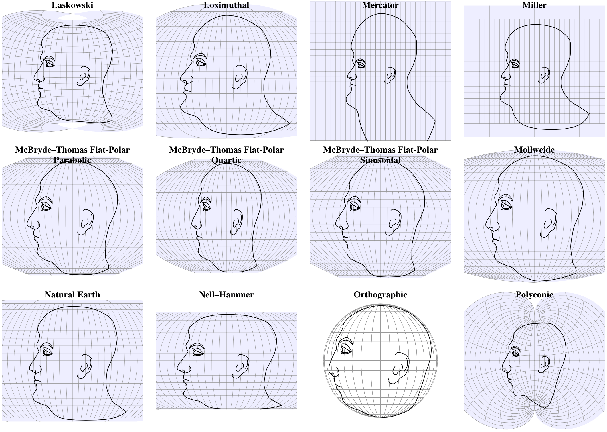
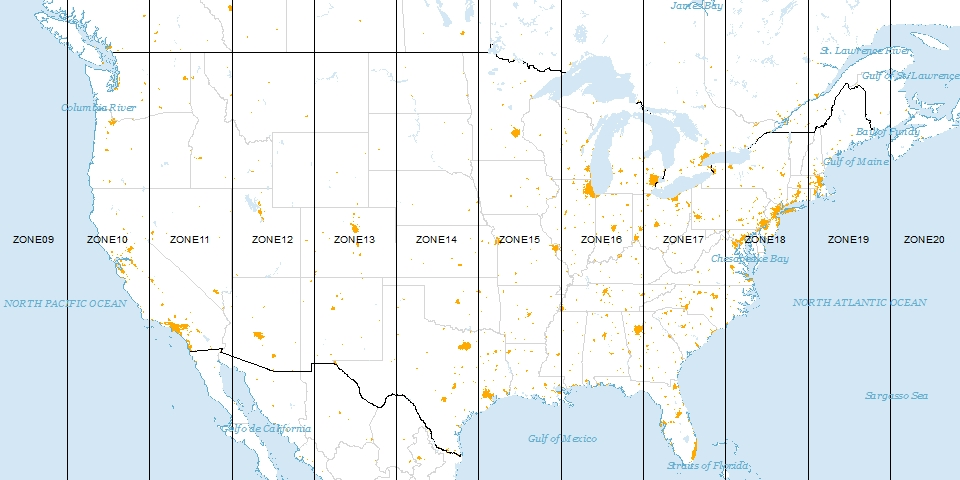

```{r setup, include=FALSE}
knitr::opts_chunk$set(echo = TRUE)
library(tidyverse)
library(knitr)
library(mnormt)
library(plgp)
library(reshape2)
library(raster)
library(ggmap)
library(rgdal)
set.seed(02092021)
```

```{r, message = F, echo = F}
seattle <- read_csv('SeattlePolice.csv')
```

# Cartography

## Distance Calculations

A collaborator suggests that there may a spatial relationship between the police calls in the Seattle Data Set. How would you calculate the distance between those points?

```{r, echo = F}
seattle %>% slice(1:3) %>% dplyr::select(Event.Clearance.Description, Longitude, Latitude) %>% kable
```

\vfill
\vfill


\vfill

\newpage


## Map Projections

```{r, out.width = "400px", echo = F}

```

\vfill


## Map Projections

\vfill

\vfill

\vfill

\newpage

## Mercator projections

A projection type we will use in this class is the Mercator projection. The Mercator projection gives the common square maps you are used to looking at. 

$$ f(\lambda, \phi) = R\lambda, \; \; g(\lambda, \phi) = R * ln \left( tan \left( \frac{\pi}{4} + \frac{\phi}{2}\right) \right)$$

\vfill

\vfill

## UTM Projections

\vfill

```{r, out.width = "400px", echo = F}

```

\vfill

\newpage

## Distances on the earth's surface
According to *Gauss' Theorema Eggregrium* in differential geometry, 

\vfill

## Distance Metrics

As a precursor to this class, I said "objects close in space tend to be more similar." Mathematically, we will require precise distance measurements between points.

\vfill


\vfill


\vfill

## Geodesic distance

The geodesic distance in computed as $D = R \phi,$ where $R$ is the radius of the earth and $\phi$ is an angle (in radians) such that:

$$\cos \phi = \sin\theta_1 \sin \theta_2 + \cos \theta_1 \cos \theta_2 cos(\lambda_1 - \lambda_2),$$
\vfill

\vfill

## Chordal Distance
Another alternative is to use what is known as the chordal distance, which is equivalent to the "burrowed through the earth" distance between two points on the Earth's surface.

Let
\begin{eqnarray*}
x &=& R \cos \theta \cos \lambda \\
y &=& R \cos \theta \sin \lambda \\
z &=& R \sin \theta,
\end{eqnarray*}
where $x,$ $y$, and $z$ form a set of Cartesian coordinates with the origin at the center of the earth, the $z$-axis runs between the north and south poles. 

\vfill


\newpage

## Distance Calculation Example
Calculate the distance between Chicago (41.8781° N, 87.6298° W) and Minneapolis (44.9778° N, 93.2650° W) using naive Euclidean, geodesic, and chordal measures. Note naive Euclidean can be computed by multiplying Euclidean distance (on radians) by R.

```{r, echo=T}
theta1 <- 41.88 * pi / 180 # in Radians
theta2 <- 44.89 * pi / 180
lambda1 <- 87.63 * pi / 180
lambda2 <- 93.22 * pi / 180
R <- 6371
```

\vfill

\newpage

## Spatial Data Structures in R

Spatial objects in R have two different structures: 

\vfill


## Plotting Shape Files
```{r, eval = T, message = F}
#mykey <- read_file('google_api.txt')
#register_google(key = mykey, write = T)
GYE <- c(left = -113, bottom = 42, right = -108, top = 46)
GYE_map <- get_map(GYE) %>% ggmap()
  
Grizzly <- readOGR(dsn = "./GB_Distribution_2000_2014", 
                   layer = "GB_Distribution_2000_2014", 
                   verbose = F)
  Grizzly <- spTransform(Grizzly, CRS("+proj=longlat +datum=WGS84"))
  Grizzly <- fortify(Grizzly)
  GYE_map + 
    geom_polygon(aes(x=long, y=lat, group=group), fill='gray', size=.2,color='gray', 
                 data=Grizzly, alpha=.5) + 
    ggtitle("Established Grizzly Bear Range: 2000 - 2014")
```


\newpage

## Raster data
A raster consists of a matrix that contains values for each pixel.
```{r,echo = T}
tmp.raster <- raster(ncol=5, nrow=5, ymx = 5, ymn = 1,xmx=5, xmn=1, crs = NA)
tmp.raster
values(tmp.raster) <- runif(25)
```

## Raster data

```{r}
plot(tmp.raster, main='5-by-5 Raster')
```

\newpage

## Spatial Statistics Notation


\vfill


\newpage
~
