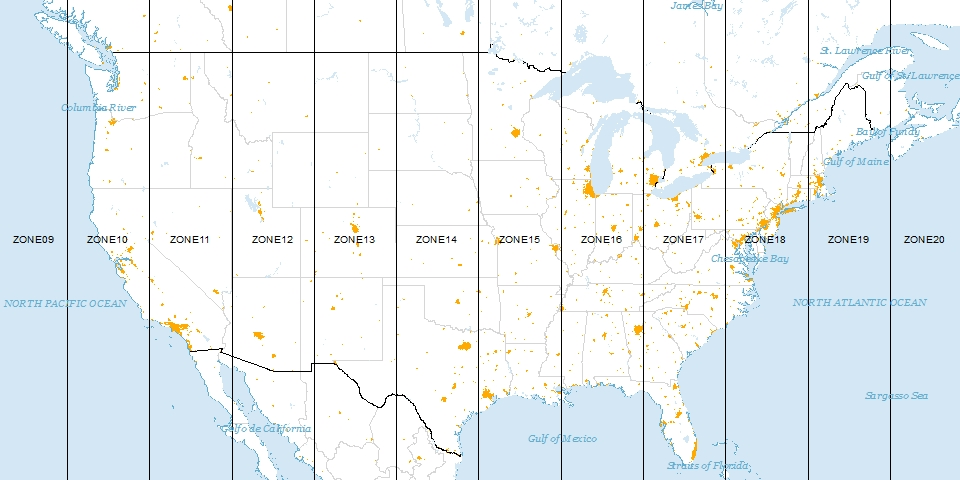

```{r setup, include=FALSE}
knitr::opts_chunk$set(echo = TRUE)
library(tidyverse)
library(knitr)
library(mnormt)
library(plgp)
library(reshape2)
library(raster)
library(ggmap)
library(rgdal)
set.seed(02092021)
```

```{r, message = F, echo = F}
seattle <- read_csv('SeattlePolice.csv')
```

# Cartography

## Distance Calculations

A collaborator suggests that there may a spatial relationship between the police calls in the Seattle Data Set. How would you calculate the distance between those points?

```{r, echo = F}
seattle %>% slice(1:3) %>% dplyr::select(Event.Clearance.Description, Longitude, Latitude) %>% kable
```

\vfill
\vfill


*As a follow up:*

*- what are the units for your distances?*
\vfill

*- are they consistent across latitude?*

\vfill

\newpage


## Map Projections

```{r, out.width = "400px", echo = F}
knitr::include_graphics("face.png")
```

\vfill


## Map Projections

*Map projections are a representation of a surface on a plane. Specifically, functions are designed to map the geographical coordinate system $(\lambda, \phi)$ to rectangular or polar coordinates ($x, y$) such that:*

\vfill

$$x = f(\lambda, \phi), \; \; y = g(\lambda, \phi),$$

*where $f$ and $g$ are functions that define the projection.*

\newpage

## Mercator projections

A projection type we will use in this class is the Mercator projection. The Mercator projection gives the common square maps you are used to looking at. 

$$ f(\lambda, \phi) = R\lambda, \; \; g(\lambda, \phi) = R * ln \left( tan \left( \frac{\pi}{4} + \frac{\phi}{2}\right) \right)$$

*The Mercator projection typically includes a rectangular grid and locations are expressed in meters from the intersection of grid lines. Common terminology is to use "easting" and "northings" for the coordinates.* 

\vfill

## UTM Projections

*The UTM projection divides the world into 60 vertical slices, known as zones.*

```{r, out.width = "400px", echo = F}

```

\newpage

## Distances on the earth's surface
According to *Gauss' Theorema Eggregrium* in differential geometry, *a planar map projection that preserves distances between points does not exist.*

\vfill

## Distance Metrics

As a precursor to this class, I said "objects close in space tend to be more similar." Mathematically, we will require precise distance measurements between points.

\vfill


- *Euclidean distance: is the straightline distance between two points, recall the Pythagorean thereom. This works okay (with latitude and longitude) for points in a small spatial domain, such as New York City. However, the curvature of the earth causes distortions for larger areas.*

\vfill


- *geodesic distance: is the length of the arc on the Earth's surface.*

\vfill

## Geodesic distance

The geodesic distance in computed as $D = R \phi,$ where $R$ is the radius of the earth and $\phi$ is an angle (in radians) such that:

$$\cos \phi = \sin\theta_1 \sin \theta_2 + \cos \theta_1 \cos \theta_2 cos(\lambda_1 - \lambda_2),$$
*where $\theta_1$ and $\theta_2$ are the latitude measurements and $\lambda_1$ and $\lambda_2$ are the longitude measurements for two points.*

*Thus*

$$D = R \arccos[\sin\theta_1 \sin \theta_2 + \cos \theta_1 \cos \theta_2 cos(\lambda_1 - \lambda_2)]$$

\vfill

## Chordal Distance
Another alternative is to use what is known as the chordal distance, which is equivalent to the "burrowed through the earth" distance between two points on the Earth's surface.

Let
\begin{eqnarray*}
x &=& R \cos \theta \cos \lambda \\
y &=& R \cos \theta \sin \lambda \\
z &=& R \sin \theta,
\end{eqnarray*}
where $x,$ $y$, and $z$ form a set of Cartesian coordinates with the origin at the center of the earth, the $z$-axis runs between the north and south poles. 

Then the chordal distance can be calculated as the Euclidean distance between two vectors $\boldsymbol{u}_1 = (x_1, y_1, z_1)$ and $\boldsymbol{u}_1 = (x_1, y_1, z_1)$.


\newpage

## Distance Calculation Example
Calculate the distance between Chicago (41.8781° N, 87.6298° W) and Minneapolis (44.9778° N, 93.2650° W) using naive Euclidean, geodesic, and chordal measures. Note naive Euclidean can be computed by multiplying Euclidean distance (on radians) by R.

```{r, echo=T}
theta1 <- 41.88 * pi / 180 # in Radians
theta2 <- 44.89 * pi / 180
lambda1 <- 87.63 * pi / 180
lambda2 <- 93.22 * pi / 180
R <- 6371
```

## Distance Calculation Solution

```{r, echo = T}
geodesic <- R * acos(sin(theta1)*sin(theta2) + 
 cos(theta1)*cos(theta2)*cos(lambda1 - lambda2))

euc <- sqrt((theta1 - theta2)^2 + (lambda1 - lambda2)^2) * R 

chord <- sqrt(
 (R * cos(theta1) * cos(lambda1) - R * cos(theta2) * cos(lambda2))^2 +
 (R * cos(theta1) * sin(lambda1) - R * cos(theta2) * sin(lambda2))^2 +
 (R * sin(theta1) - R * sin(theta2))^2)  
```

The end result is that the geodesic distance is `r round(geodesic,2)` distance and the chordal distance `r round(chord,2)` are very close, but the naive Euclidean `r round(euc,2)` is quite a bit different.

\newpage

## Spatial Data Structures in R

Spatial objects in R have two different structures: 

- Vector data: vector data consist of points, shapes and lines, all with defined borders.

- Raster data: consists of a gridded set of pixels and often coincides with remote sensed data.


## Plotting Shape Files
```{r, eval = T, message = F}
#mykey <- read_file('google_api.txt')
#register_google(key = mykey, write = T)
GYE <- c(left = -113, bottom = 42, right = -108, top = 46)
GYE_map <- get_map(GYE) %>% ggmap()
  
Grizzly <- readOGR(dsn = "./GB_Distribution_2000_2014", 
                   layer = "GB_Distribution_2000_2014", 
                   verbose = F)
  Grizzly <- spTransform(Grizzly, CRS("+proj=longlat +datum=WGS84"))
  Grizzly <- fortify(Grizzly)
  GYE_map + 
    geom_polygon(aes(x=long, y=lat, group=group), fill='gray', size=.2,color='gray', 
                 data=Grizzly, alpha=.5) + 
    ggtitle("Established Grizzly Bear Range: 2000 - 2014")
```

For more details on `ggmap` see [ggmap readme](https://cran.r-project.org/web/packages/ggmap/readme/README.html)

## Raster data
A raster consists of a matrix that contains values for each pixel.
```{r,echo = T}
tmp.raster <- raster(ncol=5, nrow=5, ymx = 5, ymn = 1,xmx=5, xmn=1, crs = NA)
tmp.raster
values(tmp.raster) <- runif(25)
```

## Raster data

```{r}
plot(tmp.raster, main='5-by-5 Raster')
```

\newpage

## Spatial Statistics Notation

- The response, $Y(\boldsymbol{s})$, is a random variable at location(s) $\boldsymbol{s}$

\vfill
- $\boldsymbol{s}$ varies continuously over the space

\vfill

- Typically, $\boldsymbol{s} \in \mathcal{R}^2$ or $\boldsymbol{s} \in \mathcal{D}$, where $\mathcal{D} \subset \mathcal{R}^2$, such as Montana.

\vfill

- $Y(\boldsymbol{s})$ is a stochastic process, or a collection of random variables.

\vfill

- In spatial settings, $Y(\boldsymbol{s})$ is referred to as a *spatial process*.

\vfill

- Spatial covariance is characterized by the distance between locations

\vfill

- By specifying a structured form for the covariance function, few parameters are necessary


\vfill


\vfill

- A common covariance is the exponential covariance, where
$$Cov(Y(\boldsymbol{s}_1),Y(\boldsymbol{s}_2)) = \sigma^2 \exp(- d_{12}/\phi),$$


\vfill

- Spatial models include a *nugget* effect to account point level variability. This can be thought of as measurement error, or randomness inherent in the process.


\vfill

- Hence for a single point,
$$Cov(Y(\boldsymbol{s}_i),Y(\boldsymbol{s}_i)) = \sigma^2 \exp(- d_{12}/ \phi) + \tau^2,$$


\vfill
A joint distribution is specified to model the spatial covariance using standard likelihood-based techniques.


\vfill

- Let $\boldsymbol{Y} := \{Y(\boldsymbol{s}_i) \}$ for locations $\boldsymbol{s_i}, i = 1, \dots, n$


\vfill

- Then assume 
$$\boldsymbol{Y}|\mu, \boldsymbol{\theta} \sim MVN_n(\mu \boldsymbol{1}_n, \Sigma(\boldsymbol{\theta})),$$
where $\boldsymbol{\theta}$ is a vector of parameters that determine the variance.

\vfill
 - Write out the likelihood for $\boldsymbol{Y}$:
$$\boldsymbol{Y}|\mu, \boldsymbol{\theta} = (2 \pi) ^{n/2} |\Sigma(\boldsymbol{\theta})|^{-1/2} \exp\left[-\frac{1}{2}(\boldsymbol{Y} - \boldsymbol{1}\mu)^T \Sigma(\boldsymbol{\theta})^{-1} (\boldsymbol{Y} - \boldsymbol{1}\mu) \right]$$


\vfill

Given that we assume $$\boldsymbol{Y}|\mu, \boldsymbol{\theta} \sim MVN_n(\mu \boldsymbol{1}_n, \Sigma(\boldsymbol{\theta})),$$

\vfill

- it is also reasonable to assume that the response at a set of unobserved locations, $\boldsymbol{Y}(\boldsymbol{s^*})$ also follows a multivariate normal distribution.


\vfill
- this results in an infinite dimensional normal distribution, which is also know as a Gaussian Process (GP)


\vfill

